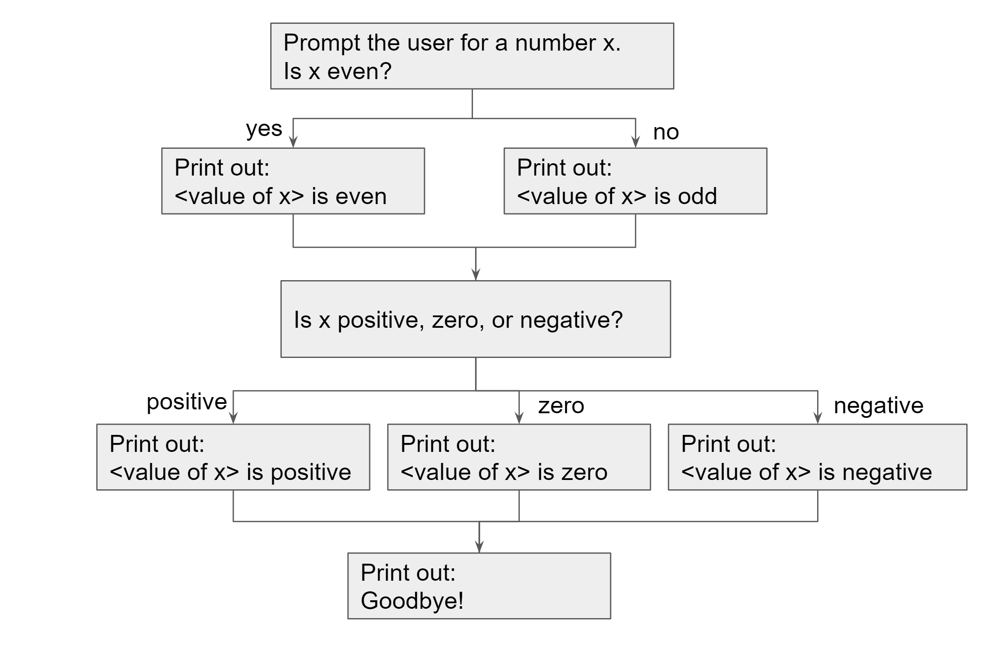

# Lab 4: Boolieve It Or Not

In this lab, you will learn how to:
- use `bool` variables
- use comparison operators
- use if statements
- use switch statements

## Question 1: odd.cpp

You work at the Boolieve It Or Not museum where exotic artifacts from all over the world are brought together for everyone to gaze at. The theme this week is the Wonders of Mathematics and you are in charge of a live exhibition on the *oddity of numbers*.

You will write the `odd.cpp` program that:

1. Prompts the user for a number
1. Prints whether that number is even or odd
1. Prints whether that number is positive, negative, or zero
1. Says goodbye

This flowchart represents the structure of your program:


### Program requirements

1. Your program should print out "Enter a number:" followed by a newline. It should get the user's input and store it in an `int` variable named `x`.
1. The flowchart splits depending on whether `x` is odd so your code will need a conditional statement.
First, come up with an expression of type `bool` that is `true` when `x` is even and `false` when `x` is odd. 
Hint: when x is an even number, the remainder when x is divided by 2 is 0. 
Now, write an if-else statement using that expression as the condition.
1. Inside the if block of that statement, print out `"<value of x> is even"` followed by a newline.
For example, if `x` has the value `2`, this should print `2 is even`.
1. Inside the else block, print out `"<value of x> is odd"` followed by a newline.
1. Now the flowchart shows that the two paths meet back up again. This means that regardless of whether x was even or not,
the next piece of code should execute. This time, the path branches 3 ways, so you should use an `if-else if-else` statement.
First, come up with an expression that checks if x is positive. Then come up with one that checks if x is zero. Fill those in the
correct parts of the `if-else if-else` statement.
1. Next, fill in the code inside each block:
    * If x is positive, print out `"<value of x> is positive"` followed by a newline.
    * If x is zero, print out `"<value of x> is zero"` followed by a newline.
    * If x is negative, print out `"<value of x> is negative"` followed by a newline.
1. Finally, regardless of what happened before, your program should print out `"Goodbye!"` followed by a newline and exit with return code 0.

### Example expected output

Your terminal should look exactly like this when you run your program and give it `2` as the input:
```
$ ./a.out
Enter a number:
2
2 is even
2 is positive
Goodbye!
$
```

Your terminal should look exactly like this when you run your program and give it `-3` as the input:
```
$ ./a.out
Enter a number:
-3
-3 is odd
-3 is negative
Goodbye!
$
```

Your terminal should look exactly like this when you run your program and give it `0` as the input:
```
$ ./a.out
Enter a number:
0
0 is even
0 is zero
Goodbye!
$
```

## Question 2: calculator.cpp

A calculator is a key artifact in the world of Mathematics. You are supposed to bring one out for display, but a thief broke in and stole it last night! Quick, program another one!

This question is very similar to `question4/bowser.cpp` from Lab 2. You might want to look back to see if you can reuse some of your code.

This time, instead of printing out the result of all operations, your program will only print out the result of the operation the user asks for.

### Program requirements

Write the `calculator.cpp` program to do the following:

1. Declare two `int` variables named x and y.
1. Print out "Enter an integer number x:" followed by a newline.
1. Store what the user inputs on `cin` in `x`.
1. Print out "Enter an integer number y:" followed by a newline.
1. Store what the user inputs on `cin` in `y`.
1. Print out "Enter the operation to do:" followed by a newline.
1. When the program is run, the user will type in "add", "subtract", "multiply", "divide", or "modulus". Store what the user inputs on `cin` in a new variable of the appropriate type.
1. Print out the result of **only** the operation the user wants. It should follow the same format as for Lab 2.
    * If the user types in something that is not a valid operation, do the following instead:
      * Print out `"Invalid operation."` followed by a newline. 
      * Then print out `"Available operations: add, subtract, multiply, divide, modulus"` followed by a newline. 
      * Return an exit code of 1.
    * If the user tries to divide by 0, the program should print out `"Division by 0 is not allowed!"` followed by a newline. Then it should immediately return an exit code of 2.
    * If the user tries to do modulus by 0, the program should print out `"Modulus by 0 is not allowed!"` followed by a newline. Then it should immediately return an exit code of 2.
1. The program should return an exit code of 0 unless the user typed in an invalid operation.

A reminder on output format:
* add: Print out "x + y = " followed by the value of x + y followed by a newline
* subtract: Print out "x - y = " followed by the value of x - y followed by a newline
* multiply: Print out "x \* y = " followed by the value of x \* y followed by a newline
* divide: Print out "x / y = " followed by the value of x / y followed by a newline
* modulus: Print out "x % y = " followed by the value of x % y followed by a newline

### Example expected output

Inputs: `3 2 add`
```
$ ./a.out
Enter an integer number x:
3
Enter an integer number y:
2
Enter the operation to do:
add
x + y = 5
$
```
If you check the exit code, it should be 0.

Inputs: `1 10 bad`
```
$ ./a.out
Enter an integer number x:
1
Enter an integer number y:
10
Enter the operation to do:
bad
Invalid operation.
Available operations: add, subtract, multiply, divide, modulus
$
```
If you check the exit code, it should be 1.

Inputs: `5 0 divide`
```
$ ./a.out
Enter an integer number x:
5
Enter an integer number y:
0
Enter the operation to do:
divide
Division by 0 is not allowed!
$
```
The exit code should be 2.

Inputs: `5 0 modulus`
```
$ ./a.out
Enter an integer number x:
5
Enter an integer number y:
0
Enter the operation to do:
modulus
Modulus by 0 is not allowed!
$
```
The exit code should be 2.

## Question 3: visit.cpp

Both the live exhibition and the display were huge successes! Sales are going through the roof and you can't possibly accommodate all the visitors at once! Your manager proposes to split them up by day of the week based on their age.

### Program requirements

Write the `visit.cpp` program that does the following:

1. Ask the user `"How old are you?"` followed by a newline.
1. Store the answer in an `int` variable named `age`.
1. Depending on the result of `age % 7`, print out the following:
    * 0 -> "Come on Sunday!" + newline
    * 1 -> "Come on Monday!" + newline
    * 2 -> "Come on Tuesday!" + newline
    * 3 -> "Come on Wednesday!" + newline
    * 4 -> "Come on Thursday!" + newline
    * 5 -> "Come on Friday!" + newline
    * 6 -> "Come on Saturday!" + newline
    * other -> "Don't come..." + newline
1. Return 0.

**Note**: You must use a `switch` statement to achieve the above.

### Example expected output

Inputs: `50`
```
$ ./a.out
How old are you?
50
Come on Monday!
$
```

Inputs: `-9`
```
$ ./a.out
How old are you?
-9
Don't come...
$
```

## Rubric

* (60 points + 10 bonus points) Programming
    * (15 points) `odd.cpp`
      * (1 point) Code compiles
      * (1 point) TODO comment check
      * (5 points) Style check
      * (8 points) Test cases
    * (40 points) `calculator.cpp`
      * (1 point) Code compiles
      * (1 point) TODO comment check
      * (6 points) Style check
      * (32 points) Test cases
    * (15 points) `visit.cpp`
      * (1 point) Code compiles
      * (1 point) TODO comment check
      * (4 points) Style check
      * (9 points) Test cases -> You must use a `switch` statement to receive the points
* (40 points) Written assignment - see Gradescope for point breakdowns
